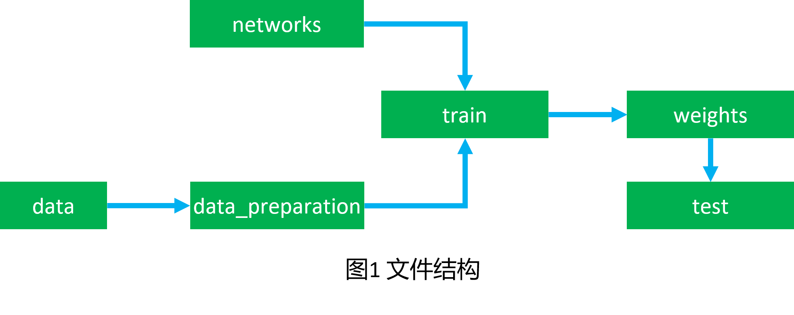
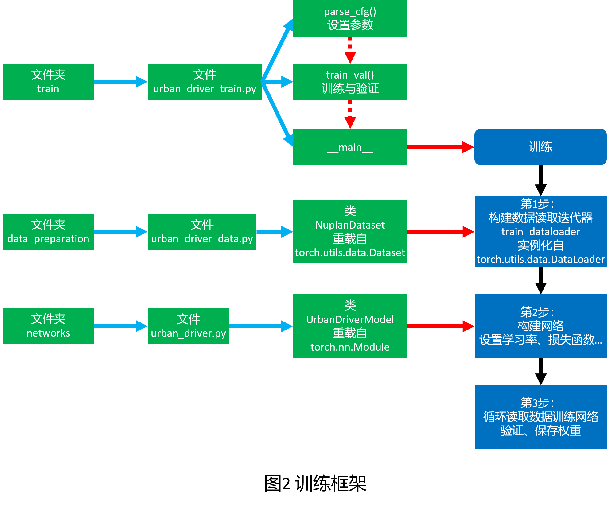

# 自动驾驶框架

## 一、数据集 Datasets

### 1. [Level 5](https://arxiv.org/abs/2006.14480)

### 2. [nuPlan](https://arxiv.org/abs/2106.11810)

1.1 mini数据集

data/nuplan/mini

1.2 精选数据集

data/nuplan/selected

1.3 完整数据集

data/nuplan/full

### 3. [nuScenes](https://arxiv.org/abs/1903.11027)

## 二、算法 Algorithms

### 1. 鸟瞰图——>路径规划 Bird's-Eye View to Path Planning

### 2. 环视相机——>路径规划 Surround Monocular Cameras to Path Planning

### 3. 环视相机——>鸟瞰图 Surround Monocular Cameras to Bird's-Eye View

## 三、对比

### 1. Level 5

|方法|指标1|指标2|指标3|
|---|---|---|--|
|||||
|||||
|Urban Driver||||

### 2. nuScenes
|||||||||
|---|---|---|---|---|---|---|---|
|GT	| x0y0	| x1y1 |	x2y2 |	x3y3 |	x4y4 |	x5y5 |	x6y6|
|Output	|	| Δx1'Δy1'	| Δx2'Δy2'	| Δx3'Δy3'	| Δx4'Δy4' |	Δx5'Δy5'	| Δx6'Δy6'|
|Prediction | | x1'y1'=x0y0+Δx1'Δy1' | x2'y2'=x1'y1'+Δx2'Δy2' | x3'y3'=x2'y2'+Δx3'Δy3' | x4'y4'=x3'y3'+Δx4'Δy4' | x5'y5'=x4'y4'+Δx5'Δy5'| x6'y6'=x5'y5'+Δx6'Δy6'|
|Target |	| x1y1-x0y0 |	x2y2-x1'y1' |	x3y3-x2'y2' |	x4y4-x3'y3' |	x5y5-x4'y4' |	x6y6-x5'y5'|
|||||||||

### 2. nuPlan

1.1 mini

|方法|指标1|指标2|指标3|
|---|---|---|--|
|Simple Planner||||
|IDM Planner||||
|Urban Driver||||

1.2 完整数据集

|方法|指标1|指标2|指标3|
|---|---|---|--|
|Simple Planner||||
|IDM Planner||||
|Urban Driver||||

## 四、实用算法

预训练权重下载链接：

https://syncandshare.lrz.de/getlink/fi6mGLJoqSu3GEBxW7aWNT/weights

### 1. 物体检测

1.1 YOLOv5

1.2 YOLOv8

### 2. 语义分割

1.1 YOLOv5_sg

### 3. 实例分割